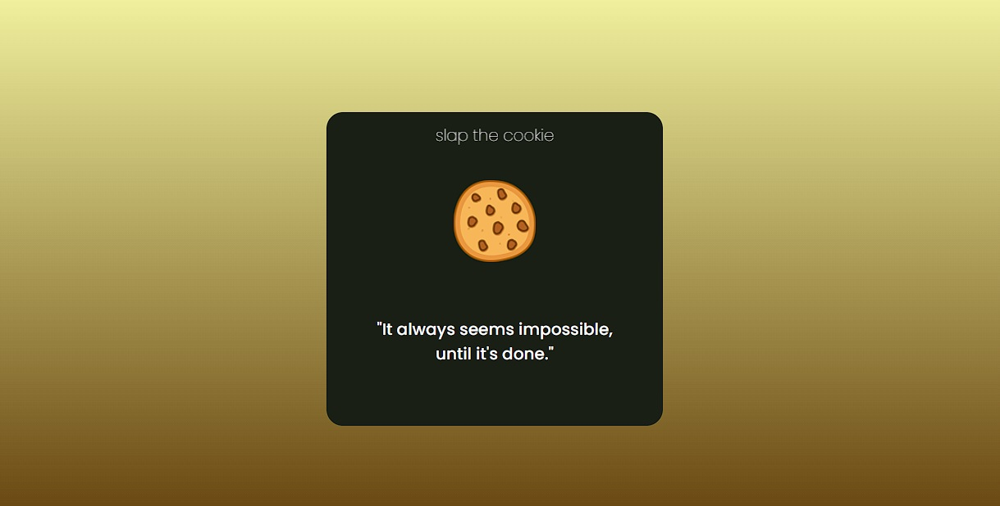

# Looky Cookie 🍪

## How to i create

This is my first, and _simple_, project consuming a **public API**, for this case i use [Adivice API](https://api.adviceslip.com/) and **AXIOS** client directly with your **CDN in HTML**

## How to use
    1 - Look at delicious cookie on the center
    2 - click and take the advice to your bed

## Next updates
-   <b>Responsivity
-   Header and footer
-   Clean code</b>

### Axios documentation

[AXIOS](https://axios-http.com/docs/intro)

<i>have a good time<i>